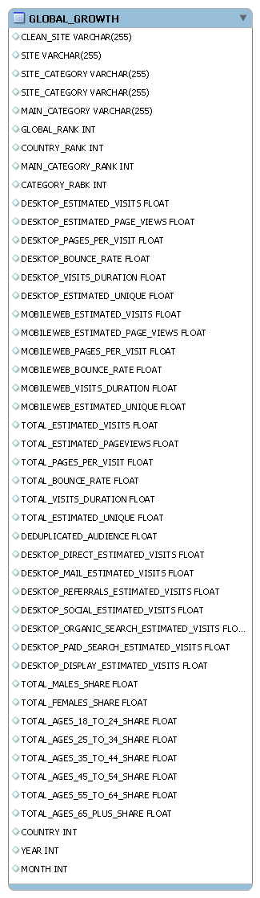

#ELT proces datasetu Global Public Companies Traffic Growth

Tento repozitár predstavuje implementáciu ELT procesu v Snowflake a vytvorenie dátového skladu so schémou Star Schema na základe Global Public Companies Traffic Growth datasetu. Projekt je zameraný na obchodnú analýzu tempa rastu Alza.sk, návratnosti investícií, porovnanie s lokálnymi aj globálnymi konkurentmi. Hodnotenie rastu spoločnosti na základe online výsledkov a porovnania s lídrami v odvetví.

---

  

    <h2>1. Úvod a popis zdrojových dát</h2>

    <strong>Prečo sme si vybrali dataset:</strong>
    
Dataset poskytuje aktuálne dáta o návštevnosti, zdrojoch návštevnosti, angažovanosti používateľov a demografii, čo umožňuje analyzovať rast spoločností a ich online výkonnosť.

    <strong>Biznis proces, ktorý dáta podporujú:</strong>
    <ul>
      <li>Analýza rastu návštevnosti a angažovanosti.</li>
      <li>Hodnotenie návratnosti investícií do marketingu.</li>
      <li>Benchmarking konkurencie. Detekcia trendov a rizík v dopyte.</li>
    </ul>

    <strong>Typy údajov:</strong>
    <ul>
      <li>Číselné (Float, Number) - návštevnosť, bounce rate, pages per visit, duration, rank.</li>
      <li>Kategórie (Varchar) - site, kategória, hlavná kategória.</li>
      <li>Demografické údaje (Varchar) - vekové skupiny, pohlavie.</li>
      <li>Časové údaje (Number) - mesiac, rok.</li>
    </ul>

    <strong>Predstavenie tabuľky GLOBAL_GROWTH:</strong>
    
Obsahuje mesačné údaje o návštevnosti webov, rozdelené podľa platformy (desktop/mobile), kanálov (organic, paid, social, mail, referrals), a demografie používateľov. Obsahuje aj globálny a kategóriový ranking, metriky engagementu (pages per visit, bounce rate, visit duration) a celkovú návštevnosť. Slúži na monitorovanie rastu, porovnanie s konkurenciou a hodnotenie efektívnosti online marketingu.

  

  

    
  

